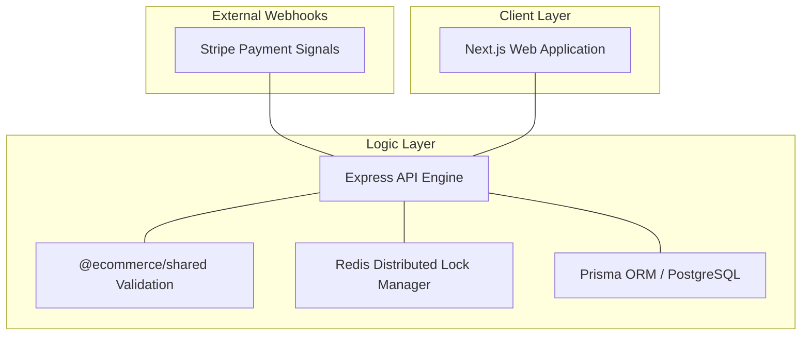

# High-Concurrency E-Commerce Monorepo

[](https://nextjs.org/)
[](https://expressjs.com/)
[](https://www.postgresql.org/)
[](https://redis.io/)
[](https://turbo.build/)
[](https://www.typescriptlang.org/)

A distributed, headless e-commerce architecture designed for high-concurrency transaction processing and automated inventory lifecycle management.

## System Architecture

The following diagram illustrates the data flow and layer interactions within the monorepo.



## Core Technical Features

- **Turborepo Orchestration**: Parallelized build and development workflows with cross-workspace task dependencies and incremental caching.
- **Zod Schema Synchronization**: Unified validation layer provided by `@ecommerce/shared` to enforce type consistency between frontend forms and backend controllers.
- **Redis-Backed Distributed Locks**: Concurrency control implemented for checkout operations to prevent race conditions and inventory over-allocation.
- **Role-Based Access Control (RBAC)**: Server-side middleware and frontend navigation guards enforcing strict access boundaries for Admin and Consumer roles.
- **Database Lifecycle Management**: Soft-delete implementation for product archiving with database-level status filtering and restoration logic.

## Technology Stack Matrix

| Layer | Technology | Purpose |
| :--- | :--- | :--- |
| **Frontend** | Next.js 15 | Server-side rendering and client-side routing. |
| **Backend** | Express.js | RESTful API orchestration and middleware management. |
| **Shared** | Zod / TS | Contract-first development and validation schemas. |
| **Database** | PostgreSQL / Prisma | Relational data persistence and schema management. |
| **Cache** | Redis | Distributed locking and transient data storage. |
| **Orchestration** | Turborepo | Monorepo build and task management. |
| **Payments** | Stripe | PCI-compliant transaction processing and webhooks. |

## Local Development Setup

### Prerequisites

- Node.js 20 or higher
- Docker Desktop (for Redis and PostgreSQL)
- Stripe CLI (for local webhook testing)

### Installation and Boot Sequence

1. **Clone and Install**
   ```bash
   npm install
   ```

2. **Configure Environment Variables**
   There are three `.env.example` templates located in the root, `apps/api/`, and `apps/web/`. Copy these files to their respective `.env` equivalents and populate the required keys.
   ```bash
   cp .env.example .env
   cp apps/api/.env.example apps/api/.env
   cp apps/web/.env.example apps/web/.env
   ```

3. **Initialize Infrastructure**
   Launch the required Redis and database services.
   ```bash
   docker compose up -d
   ```

4. **Start the Platform**
   Boot the API, Web app, and shared package in parallel using Turborepo.
   ```bash
   npm run dev
   ```

## License

MIT License. See LICENSE for details.
