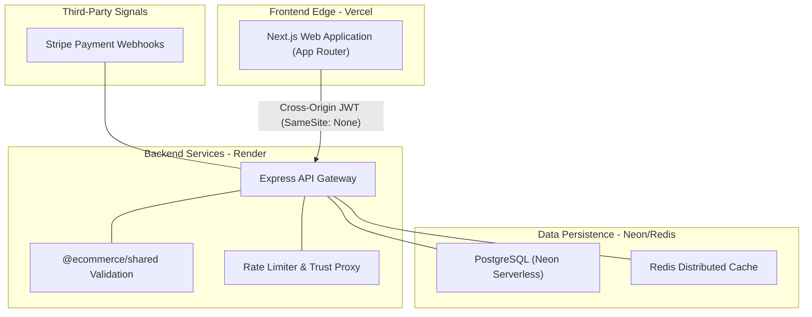

# High-Concurrency E-Commerce Monorepo

[](https://nextjs.org/)
[](https://expressjs.com/)
[](https://neon.tech/)
[](https://redis.io/)
[](https://turbo.build/)
[](https://www.typescriptlang.org/)

A distributed, headless e-commerce architecture designed for high-concurrency transaction processing, secure cross-origin authentication, and automated inventory lifecycle management.

---

## 🚀 Live Demo & Access

**Production URL:** [https://high-concurrency-ecommerce-monorepo.vercel.app](https://high-concurrency-ecommerce-monorepo.vercel.app)

**Demo Credentials:**
| Role | Email | Password | Access Level |
| :--- | :--- | :--- | :--- |
| **Admin** | `test@admin.com` | `123456` | Full Dashboard & Inventory Management |
| **User** | `testuser@gmail.com` | `password` | Shopping Cart & Checkout Flow |

*(Note: The database is refreshed periodically. Please use the credentials above to bypass registration.)*

---

## 🏗️ System Architecture

The following diagram illustrates the distributed data flow and cloud layer interactions deployed across Vercel, Render, and Neon.



---

## ⚙️ Core Technical Engineering

- **Distributed Monorepo Architecture**: Utilized Turborepo to isolate frontend (Next.js) and backend (Express/Node) environments, reducing CI/CD deployment times by enabling cached, independent micro-builds.
- **Cross-Origin Authentication Pipeline**: Engineered a secure auth flow utilizing HTTP-only JWTs with dynamic `SameSite` and `Secure` policies, safely bypassing strict browser security protocols between serverless frontends (Vercel) and load-balanced cloud runtimes (Render).
- **Serverless Database Provisioning**: Integrated a serverless PostgreSQL database (Neon) with Prisma ORM, implementing connection pooling to handle high-concurrency read/write operations during peak traffic spikes.
- **Reverse Proxy Gateway Security**: Secured the API gateway by configuring Express trust policies and robust rate-limiting (`express-rate-limit`), mitigating DDoS vectors and brute-force authentication attacks.
- **Redis-Backed Distributed Locks**: Concurrency control implemented for checkout operations to prevent race conditions and inventory over-allocation.

---

## 🛠️ Technology Stack Matrix

| Layer | Technology | Infrastructure / Purpose |
| :--- | :--- | :--- |
| **Frontend** | Next.js 15, Tailwind CSS | **Vercel** / Edge-rendered client routing & UI. |
| **Backend** | Express.js, Node.js | **Render** / RESTful API orchestration. |
| **Shared** | Zod, TypeScript | Contract-first development and validation schemas. |
| **Database** | PostgreSQL, Prisma | **Neon Serverless** / Relational data persistence. |
| **Cache** | Redis | Distributed locking and transient data storage. |
| **Orchestration** | Turborepo | Monorepo build and task management. |
| **Payments** | Stripe | PCI-compliant transaction processing. |

---

## 💻 Local Development Setup

### Prerequisites
- Node.js 20+
- Docker Desktop (for local Redis/PostgreSQL)
- Stripe CLI

### Boot Sequence

1. **Clone and Install**
   ```bash
   git clone [https://github.com/sasidhar-jonnalagadda/high-concurrency-ecommerce-monorepo.git](https://github.com/sasidhar-jonnalagadda/high-concurrency-ecommerce-monorepo.git)
   cd high-concurrency-ecommerce-monorepo
   npm install
   ```

2. **Configure Environment Variables**
   Copy the template files and populate your local keys:
   ```bash
   cp .env.example .env
   cp apps/api/.env.example apps/api/.env
   cp apps/web/.env.example apps/web/.env
   ```

3. **Initialize Infrastructure (Docker)**
   Launch the local Redis and PostgreSQL containers.
   ```bash
   docker compose up -d
   ```

4. **Hydrate the Database**
   Push the Prisma schema to your local database and run the seed script to generate admin credentials and dummy products.
   ```bash
   cd apps/api
   npx prisma db push
   npx prisma db seed
   cd ../..
   ```

5. **Start the Platform**
   Boot the API, Web app, and shared packages in parallel.
   ```bash
   npm run dev
   ```

---

## 📄 License
MIT License. See LICENSE for details.